# Smart Video Management System (VMS)

An enterprise-grade, AI-powered Video Management System (VMS) developed for the A-1 Launchpad 2026 Hackathon.

## 1. Project Overview
Smart VMS is a comprehensive web-based platform for managing IP cameras, RTSP streams, and local webcams. It utilizes deep learning (YOLO) for real-time person and intrusion detection within user-defined Regions of Interest (ROI).

## 2. Problem Statement
Traditional surveillance systems passively record video, requiring operators to manually review hours of footage to identify security breaches. They lack real-time intelligence, active alerting, and modular scalability.

## 3. Solution Overview
Smart VMS introduces an active, intelligent layer to surveillance. By processing camera feeds in real-time through an optimized YOLO inference pipeline, the system automatically detects unauthorized intrusions, captures photographic evidence, records synchronized video clips, and alerts operators immediately.

## 4. Key Features
- **Multi-Camera Management**: Seamlessly connect and switch between Laptop Webcams, HTTP/MJPEG IP Cameras, and RTSP streams.
- **Interactive ROI**: Draw polygons directly on the live camera feed to define restricted zones.
- **AI Intrusion Detection**: Real-time YOLO-powered person detection that triggers events only when a person enters a defined ROI.
- **Zero-Drop Continuous Recording**: Segmented MP4 recording that hooks directly into the frame processor.
- **Synchronized Playback**: Click on an intrusion event to instantly seek the video player to the exact moment of the breach.
- **Real-Time Analytics Dashboard**: Live metrics, Recharts integration, and Active Alert Panels.
- **Theme Management**: Persistent Light, Dark, and System theme switching.
- **CSV Export**: Export events and recording metadata instantly.

## 5. Screenshots

### Dashboard
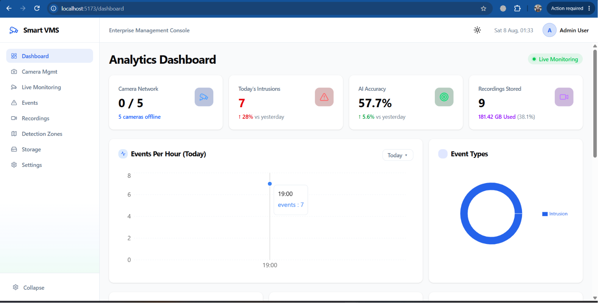
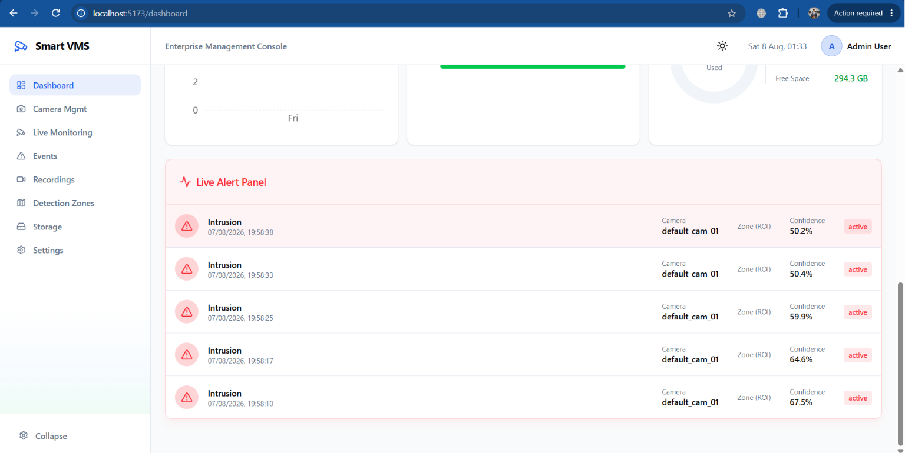
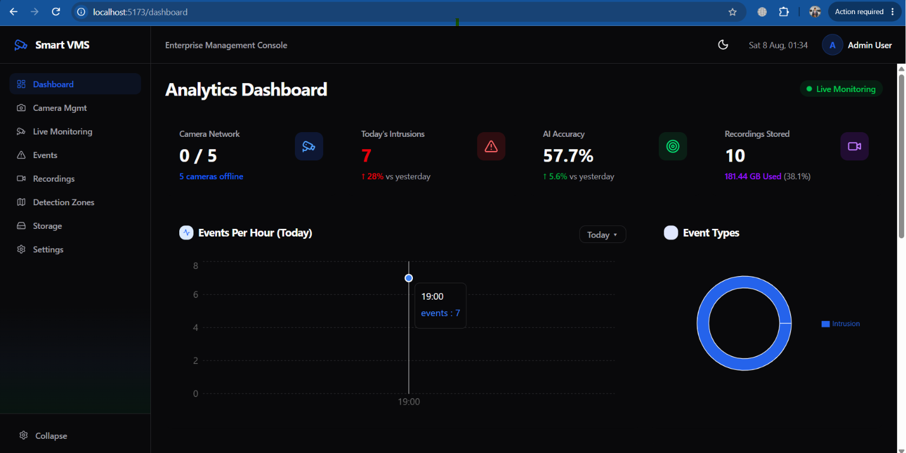

### Camera Management
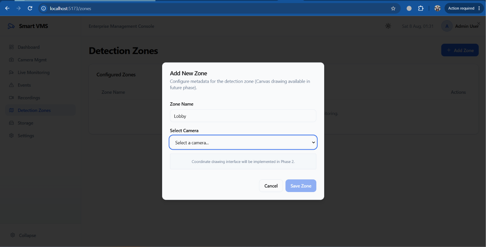

### Live Monitoring
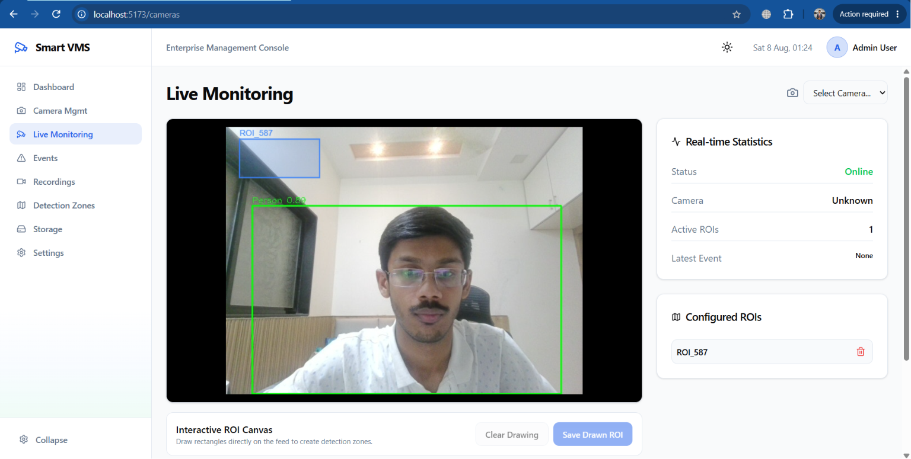

### Intrusion Detection
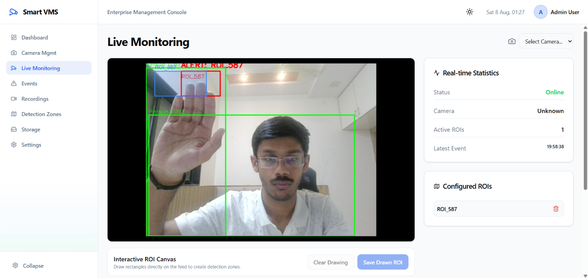

### Events
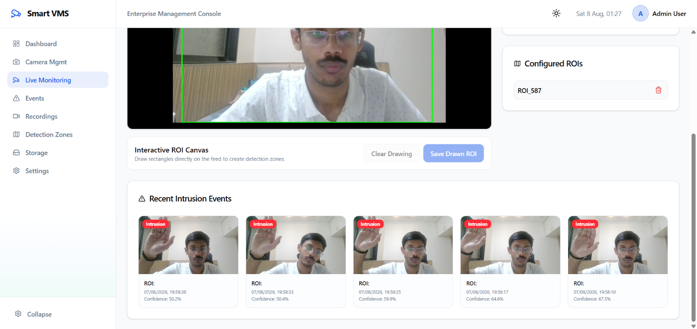

### Recordings
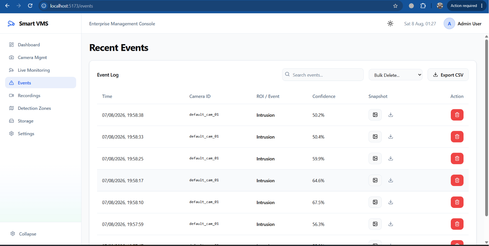
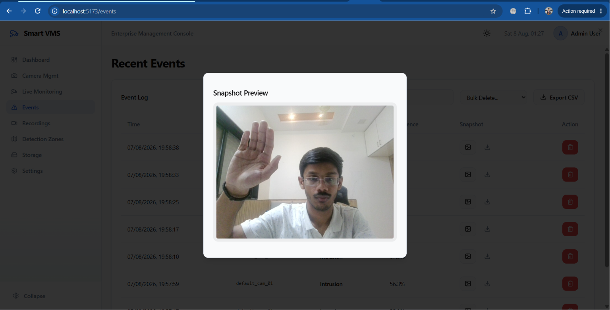
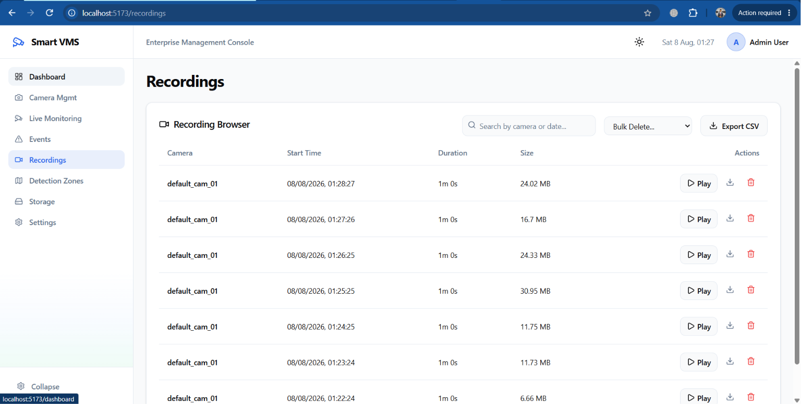
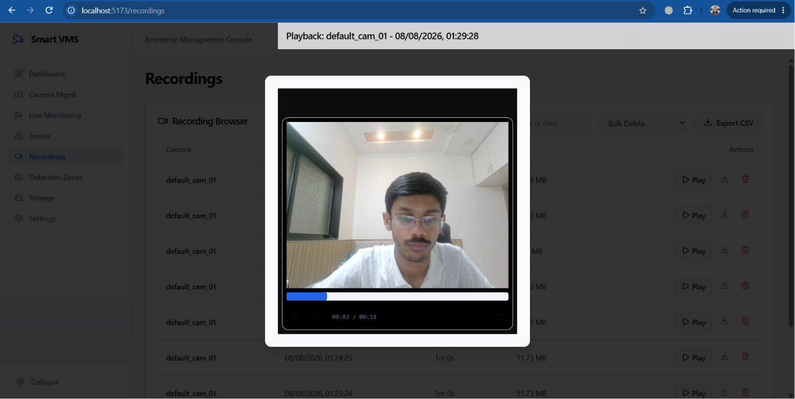

### Additional Views
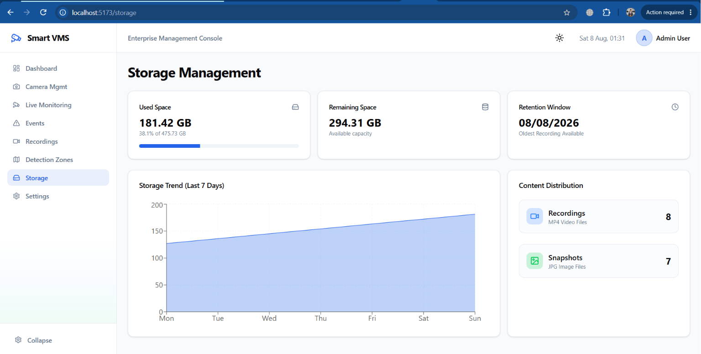
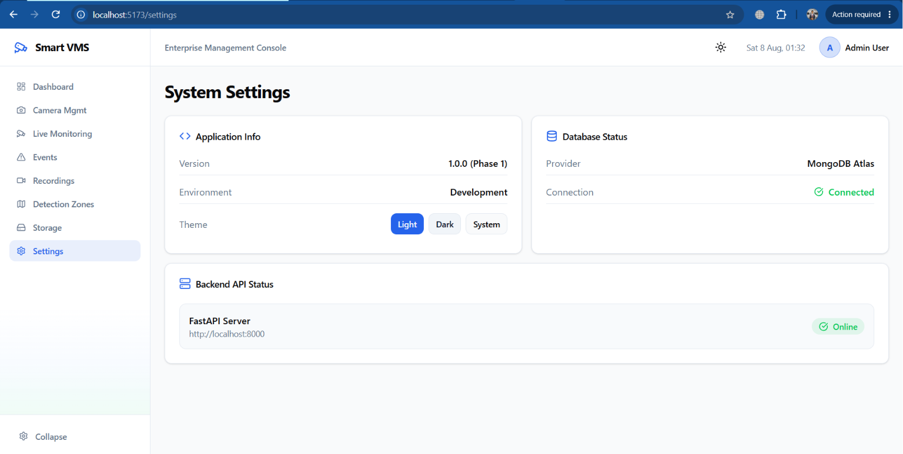


## 5. System Architecture
The system follows a modern decoupled architecture:
1. **Frontend**: React SPA serving the dashboard, live streaming UI, and playback.
2. **Backend**: FastAPI providing REST endpoints and managing the asynchronous frame processing loop.
3. **AI Engine**: Ultralytics YOLO running inside the FastAPI process.
4. **Database**: MongoDB storing configurations, events, and metadata.
5. **Storage**: Local filesystem storing H.264 `.mp4` recordings and `.jpg` snapshots.

*(See `SYSTEM_ARCHITECTURE.md` for Mermaid diagrams)*

## 6. Technology Stack
- **Frontend**: React 19, Vite, Tailwind CSS v4, shadcn/ui, Recharts, React Router
- **Backend**: Python 3.12, FastAPI, Uvicorn, Motor (Async MongoDB), OpenCV, Ultralytics YOLO
- **Database**: MongoDB Atlas

## 7. Folder Structure
```text
Smart VMS/
├── backend/
│   ├── app/
│   │   ├── api/          # FastAPI Routes (cameras, dashboard, events, live, recordings, roi, storage)
│   │   ├── db/           # MongoDB Connection
│   │   └── services/     # Core Logic (camera_service, event_service, frame_processor, recording_service, roi_service)
│   ├── storage/          # Generated mp4 and jpg files
│   ├── main.py           # FastAPI Entrypoint
│   └── requirements.txt
├── frontend/
│   ├── src/
│   │   ├── components/   # Reusable UI, Charts, VideoPlayer
│   │   ├── context/      # ThemeProvider
│   │   ├── pages/        # Dashboard, CameraManagement, LiveMonitoring, Events, Recordings, Storage, Settings
│   │   ├── router/       # React Router setup
│   │   └── services/     # Axios API Clients
│   └── package.json
└── README.md
```

## 8. Installation & Setup Guide
1. **Clone the repository**
2. **Backend Setup**:
   ```bash
   cd backend
   python -m venv venv
   # On Windows (PowerShell):
   .\venv\Scripts\activate
   # On Linux/macOS:
   source venv/bin/activate

   pip install -r requirements.txt
   ```
3. **Frontend Setup**:
   ```bash
   cd frontend
   npm install
   ```

---

## 9. How to Run the Application

### Running the Backend API Server
Open a terminal in the `backend/` directory with your virtual environment activated:
```bash
cd backend
# On Windows:
.\venv\Scripts\activate
# Start Uvicorn dev server:
python -m uvicorn main:app --reload --host 127.0.0.1 --port 8000
```
> The API will be available at: **`http://127.0.0.1:8000`**  
> OpenAPI interactive docs: **`http://127.0.0.1:8000/docs`**

### Running the Frontend React App
Open a separate terminal in the `frontend/` directory:
```bash
cd frontend
npm run dev
```
> The web application will be available at: **`http://localhost:5173`**

---

## 10. Troubleshooting & Common Fixes

### Resolving Port 8000 Conflicts (`[WinError 10013]` / Socket Permission Error)
If you get `[WinError 10013] An attempt was made to access a socket in a way forbidden by its access permissions` when starting Uvicorn, port `8000` is already in use by a background process.

**Step 1: Find the process ID (PID) using port 8000**
```powershell
netstat -ano | findstr :8000
```
Look for lines marked `LISTENING` or `ESTABLISHED`. The number at the far right is the **PID** (e.g. `45316` or `51608`).

**Step 2: Terminate the blocking process forcibly**
```powershell
taskkill /PID <PID_NUMBER> /F
# Example:
taskkill /PID 45316 /F
```

**Step 3: Restart the Backend Server**
```powershell
python -m uvicorn main:app --reload --host 127.0.0.1 --port 8000
```

---

## 11. Environment Variables
Create a `.env` file in the `backend/` directory:
```env
MONGO_URI=mongodb+srv://<username>:<password>@cluster0.mongodb.net/?retryWrites=true&w=majority
DATABASE_NAME=smart_vms
YOLO_MODEL=yolov8n.pt
PROJECT_NAME="Smart VMS"
VERSION="1.0.0"

# Telegram Alerts (Optional)
TELEGRAM_ENABLED=true
TELEGRAM_BOT_TOKEN="your_bot_token"
TELEGRAM_CHAT_ID="your_chat_id"
```

## 12. MongoDB Setup
1. Create a free cluster on MongoDB Atlas.
2. Allow IP access from anywhere (`0.0.0.0/0`).
3. Copy the Connection String and paste it into the `MONGO_URI` environment variable.
4. The backend will automatically create collections (`cameras`, `events`, `recordings`, `detection_zones`) upon first insertion.

## 13. YOLO Setup
The system uses Ultralytics YOLOv8. The weights (`yolov8n.pt`) will automatically download on the first run. The model is loaded in memory once in `yolo_service.py`.

## 14. How Live Streaming Works
The backend uses OpenCV `VideoCapture` to read frames from the active camera URL. Frames are processed, drawn on, and yielded using `StreamingResponse` with `multipart/x-mixed-replace; boundary=frame`. The React frontend consumes this directly via an `` tag.

## 15. ROI Workflow
1. User draws a rectangle on the `<canvas>` overlaid on the live feed.
2. Coordinates are normalized (0.0 to 1.0) and saved to MongoDB.
3. Backend scales these coordinates to the actual frame dimensions.
4. `RoiService` checks if any YOLO bounding box center intersects with the scaled ROI polygon.

## 16. Intrusion Detection Workflow
1. `FrameProcessor` runs YOLO inference and motion detection on the frame.
2. If intrusion occurs inside ROI, `event_service.handle_intrusion()` creates a MongoDB event immediately.
3. An async background task captures a snapshot image, sends Telegram text & snapshot alerts, and initiates a 10-second MP4 continuous recording clip.

## 17. Recording Workflow
The `RecordingService` captures the clean frame before debug overlays are drawn. Every 10 seconds, the segment is finalized, transcoded to browser-compatible H.264 MP4 using FFmpeg, saved to disk, logged to MongoDB, and updated in the original intrusion event.

## 18. API Documentation
*(See `API_DOCUMENTATION.md`)*

## 19. Database Collections
*(See `DATABASE_SCHEMA.md`)*

## 20. Troubleshooting Notes
- **Black Video Screen**: Ensure your browser supports `avc1` (H.264). 
- **Camera Connection Failed**: Check if the RTSP URL requires authentication (`rtsp://user:pass@ip`).
- **No Intrusions Triggered**: Verify that the ROI is drawn correctly and the YOLO model confidence threshold is met.

## 21. License
This project is licensed under the MIT License.


For development/testing

If you're changing React/backend source and just want to test quickly, use the dev setup:

# Terminal 1 — backend
cd "D:\projects\AIML-Projects\Smart VMS - Copy"
.\backend\venv\Scripts\python.exe -m uvicorn app.main:app --reload --port 8000
# Terminal 2 — frontend
cd "D:\projects\AIML-Projects\Smart VMS - Copy\frontend"
npm run dev

Then use the browser:

http://localhost:5173
When you want to test the actual packaged desktop app

Then yes, run:

cd "D:\projects\AIML-Projects\Smart VMS - Copy"
.\backend\venv\Scripts\python.exe build_fresh_phase5_package.py

Then:

.\dist\electron\win-unpacked\SmartVMS.exe