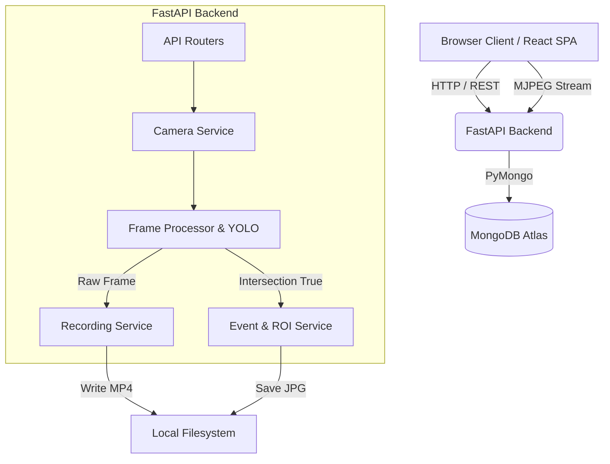
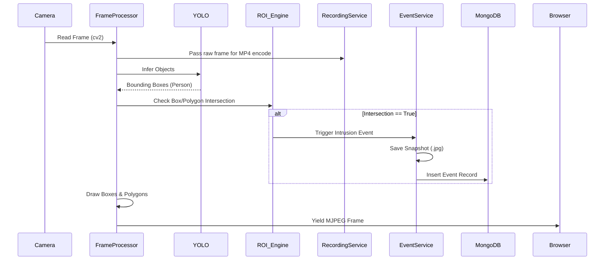

# System Architecture

Smart VMS uses a decoupled client-server architecture with an integrated asynchronous AI loop.

## High-Level Diagram

## The Processing Loop

## File Storage
Recordings are saved locally because streaming large MP4s directly to a cloud provider in real-time is prone to latency and data loss.
- `backend/storage/recordings/` - H.264 encoded MP4 files. Segmented every 60 seconds.
- `backend/storage/snapshots/` - JPG images extracted at the exact frame of intrusion.
